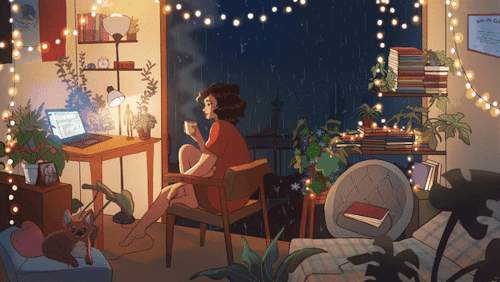

## 👋 Oi! Eu sou Thiane Deprá Saravalle

- 💻 Hoje trabalho na F1RST Digital Services como It Analyst-QE
- 📚 Cursando Análise e Desenvolvimento de Sistemas na FIAP
- 📖 Estudando Java e Solidity
- 🔭 Graduada em Química Bacharelado pela UFSM
- 🔍 Pós-graduada em Química pela UFSM e UFSCar
- 🍺 Mestre cervejeira nas horas vagas
- 🎥 Curiosa e apaixonada por series e filmes

##

   
  

##

 
  
  
  
    
  
  
   
  
  
  
  

##

 
  
  
  

##

<picture align="center">
  <source media="(prefers-color-scheme: dark)" srcset="https://raw.githubusercontent.com/thidepra/thidepra/output/github-contribution-grid-snake-dark.svg">
  <source media="(prefers-color-scheme: light)" srcset="https://raw.githubusercontent.com/thidepra/thidepra/output/github-contribution-grid-snake-dark.svg">
  
</picture>

##
